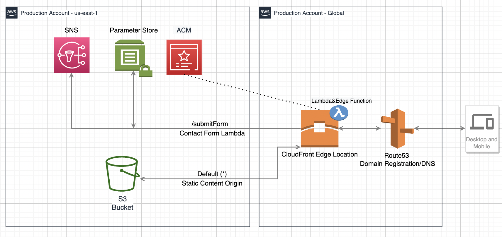

# Stephen Krawczyk's Biographical Website - AWS CDK Deployment

This repo allows for repeatedly deploying *Stephen Krawczyk's Biographical Website* with very little manual prerequisites. The site leverages CloudFront's global distributed network of edge locations as well as Lambda&Edge for contact form submission logic. Due to being entirely serverless and leveraging free tiers the project costs only pennies a month compared to when it was originally running in a Laravel stack on Heroku. 

## Getting started
As previously mentioned the amount of pre-requisites to get up and running are very minimal thanks to the CDK handling the large majority of heavy lifting. In the future I'd like to automate the reCAPTCHA site key injection into the contact.html, but the other pre-reqs are pretty much unavoidable and need to be done manually.
### Manual pre-reqs
- Register any domain name in Route53
- Register the domain with [reCAPTCHA v3](https://www.google.com/recaptcha/about/) and use the secret key during deployment
- Take the site key from reCAPTCHA v3 and add it to the data-sitekey="" element in contact.html of the stephen-krawczyk-website html bundle

### Setup
Install or update the [AWS CDK CLI](https://github.com/aws/aws-cdk) from npm (requires [Node.js ≥ 14.15.0](https://nodejs.org/download/release/latest-v14.x/)). 


```bash
npm i -g aws-cdk
```

Clone this repo locally.

```bash
$ git clone https://github.com/moebaca/sk-site-s3-cdk.git
$ cd sk-site-s3-cdk
```

Now install our NPM dependencies

```bash
$ npm install
```

### Bootstrap CDK environment

Before you deploy the application you need to make sure the environment
where you are planning to deploy the site to has been bootstrapped,
specifically with the newest version of the bootstrapping stack. 

You will need to bootstrap every environment you plan to deploy the CDK
application to, which in this example is a single account. 

You only need to do this one time per environment where you want to deploy
CDK applications. If you are unsure whether your environment has been
bootstrapped already, you can always run the command again. 

Make sure you have credentials for the account and run the following
command. Since we are only bootstrapping a single environment, we don't
need to specify the environment in the bootstrap command. The CLI will
know whih environment to bootstrap based on your .aws/credentials file
(assuming a Unix-like environment as I have not tested this on Windows).

```bash
$ cdk bootstrap --cloudformation-execution-policies arn:aws:iam::aws:policy/AdministratorAccess
```

### Deploy

You should now have met all the conditions to safely deploy the projec to your AWS account. Run the below command with the required parameters.
- domain = The domain you registered in the same account with Route53 (eg. stephenkrawczyk.com)
- accountId = The account id needs to be explicitly passed as a parameter as a requirement for hosted-zone lookups
- emailAddr = This is the email address you want the contact form to send user input to
- captchaSecret = This is the secret you received from the reCAPTCHA v3 admin panel after registering your domain

```bash
$ cdk deploy -c domain=stephenkrawczyk.com -c accountId=1234567890 -c emailAddr=me@example.com -c captchaSecret=xyz
```
You will receive an email from SNS confirming your email subscription once that component of the stack has been created. Be sure to click the confirm link in the email.

### Tear down

Tear down is mostly as simple as running the below command. The only gotcha is that due to using Lambda&Edge the destroy 
will eventually say it has failed. This is because you cannot manually (in our cause automatically) delete Lambda&Edge replicas 
and need to wait up to a few hours for the service to clean itself up after the distribution is deleted. After the first run of destroy
you should try again every 30 minutes or so until you have seen the destroy successfully complete. More information [here](https://docs.aws.amazon.com/AmazonCloudFront/latest/DeveloperGuide/lambda-edge-delete-replicas.html). 

```bash
$ cdk destroy -c domain=stephenkrawczyk.com -c accountId=1234567890 -c emailAddr=me@example.com -c captchaSecret=xyz
```

## Architecture Diagram

